# Windows系统Git安装教程（详解Git安装过程）

  今天更换电脑系统，需要重新安装Git，正好做个记录，希望对第一次使用的博友能有所帮助！

## 获取Git安装程序

  到Git官网下载，网站地址：[https://git-scm.com/downloads](https://git-scm.com/downloads%EF%BC%8C%E5%A6%82%E4%B8%8B%E5%9B%BE%EF%BC%9A)，如下图：

  因为我们是用Windows系统上的浏览器访问的，Git官网自动之别到了我使用的操作系统，所以右侧直接显示下载使用Windows系统的最新版本（如果识别错误，可以在中间选择系统），点击即可下载。我下载的是 2.16.2 for Windows，文件名称是Git-2.16.2-64-bit.exe。

## Git安装过程

  双击再跟进一下流程安装即可

### 1.使用许可声明

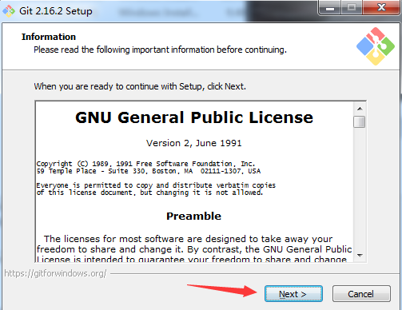

  **点击Next进入下图页面**：

### 2.选择安装路径

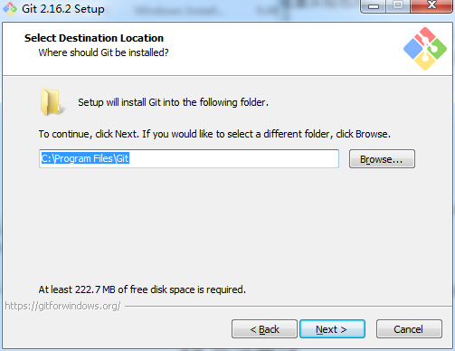

在输入框内输入想要安装到的本机路径，也就是实际文件夹位置，或点击“Browse...”选择已经存在的文件夹

### 3.选择安装组件

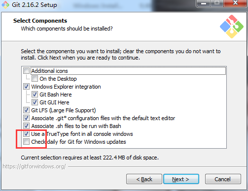

  上图红框内的选项是默认勾选的。是决定在所有控制台窗口中使用TrueType字体和是否每天检查Git是否有Windows更新的。**这些根据自己需要选择**。

  点击Next按钮进入下图界面：

### 4.选择开始菜单页

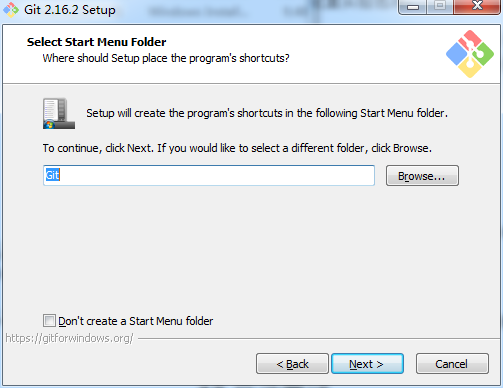

这个界面是创建开始菜单中的名称，不需要修改，直接点Next按钮继续

### 5.选择Git文件默认的编辑器

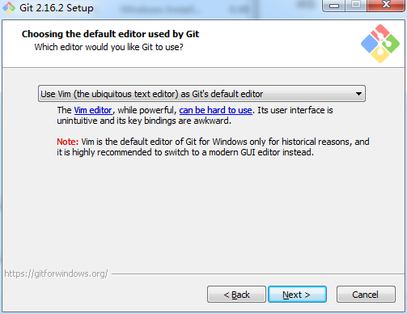

  这个页面选择Git文件默认的编辑器，很少用到，所以默认Vim即可，直接点Next按钮继续到下图的界面

### 6.调整您的PATH环境

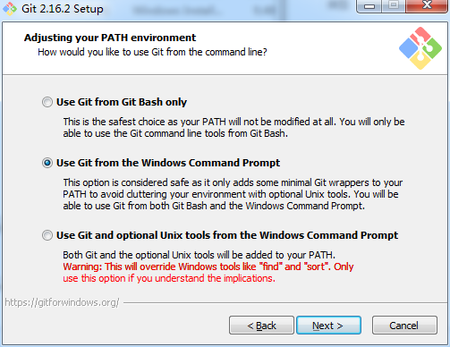

  这个界面是调整您的PATH环境。

  第一种配置是**仅从Git Bash使用Git**。这是最安全的选择，因为您的PATH根本不会被修改。您只能使用 Git Bash 的 Git 命令行工具。但是这将不能通过第三方软件使用。

  第二种配置是**从命令行以及第三方软件进行Git**。该选项被认为是安全的，因为它仅向PATH添加了一些最小的Git包装器，以避免使用可选的Unix工具造成环境混乱。
您将能够从Git Bash，命令提示符和Windows PowerShell以及在PATH中寻找Git的任何第三方软件中使用Git。这也是推荐的选项。

  第三种配置是**从命令提示符使用Git和可选的Unix工具**。警告：这将覆盖Windows工具，如 “ find 和 sort ”。只有在了解其含义后才使用此选项。

  推荐选择第二种配置，点击Next按钮继续到下图的界面

### 7.选择HTTPS后端传输

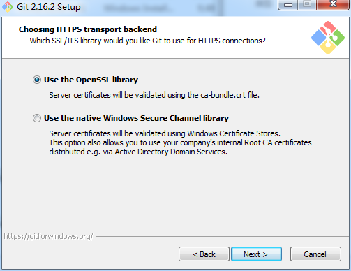

  这个界面是选择HTTPS后端传输。

  第一个选项是**使用 OpenSSL 库**。服务器证书将使用**ca-bundle.crt**文件进行验证。这也是我们常用的选项。

  第二个选项是**使用本地 Windows 安全通道库**。服务器证书将使用Windows证书存储验证。此选项还允许您使用公司的内部根CA证书，例如通过Active Directory Domain Services 。

  此处根据需要选择，也可以使用默认选项第一项

### 8.配置行尾符号转换

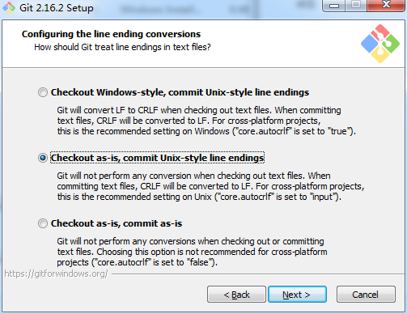

  这个界面是配置行尾符号转换。

  第一个选项是签出Windows风格，提交Unix风格的行尾。签出文本文件时，Git会将LF转换为CRLF。提交文本文件时，CRLF将转换为LF。对于跨平台项目，这是Windows上的推荐设置（“ core.autocrlf”设置为“ true”）

  第二个选项是“按原样签出，提交Unix样式的行尾”。签出文本文件时，Git不会执行任何转换。 提交文本文件时，CRLF将转换为LF。对于跨平台项目，这是Unix上的建议设置（“ core.autocrlf”设置为“ input”）

  第三种选项是“按原样签出，按原样提交”。当签出或提交文本文件时，Git不会执行任何转换。不建议跨平台项目选择此选项（“ core.autocrlf”设置为“ false”）

  根据需求选择，也可选择默认第一种

### 9.配置终端模拟器以与Git Bash一起使用

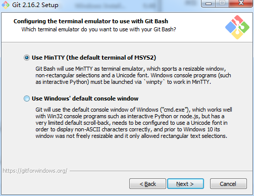

  这个界面是配置终端模拟器以与Git Bash一起使用。

  第一个选项是“使用MinTTY（MSYS2的默认终端）”。Git Bash将使用MinTTY作为终端模拟器，该模拟器具有可调整大小的窗口，非矩形选择和Unicode字体。Windows控制台程序（例如交互式Python）必须通过“ winpty”启动才能在MinTTY中运行。

  第二个选项是“使用Windows的默认控制台窗口”。Git将使用Windows的默认控制台窗口（“cmd.exe”），该窗口可以与Win32控制台程序（如交互式Python或node.js）一起使用，但默认的回滚非常有限，需要配置为使用unicode 字体以正确显示非ASCII字符，并且在Windows 10之前，其窗口不能自由调整大小，并且只允许矩形文本选择。

  根据自身需要选择，也可择默认的第一种，图标显示为git自带图标

### 10.配置配置额外的选项

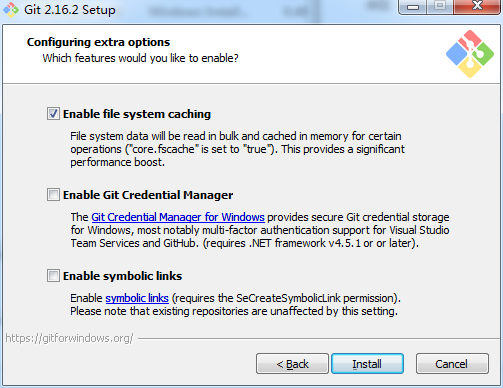

  这个界面是配置配置额外的选项。

  第一个选项是“启用文件系统缓存”。文件系统数据将被批量读取并缓存在内存中用于某些操作（“core.fscache”设置为“true”）。 这提供了显著的性能提升。

  第二个选项是“启用Git凭证管理器”。Windows的Git凭证管理器为Windows提供安全的Git凭证存储，最显着的是对Visual Studio Team Services和GitHub的多因素身份验证支持。 （需要.NET Framework v4.5.1或更高版本）。

  第三个选项是“启用符号链接”。启用符号链接（需要SeCreateSymbolicLink权限）。请注意，现有存储库不受此设置的影响。

  根据需要勾选，也可就勾选**默认第一和第二个**。

### 11.配置实验选项

  这个界面是配置实验选项。

  启用实验性的内置添加 -i / -p。（新！）使用实验性的内置交互式add（“ git add -i”或“ git add -p”）。这使其速度更快（尤其是启动！），但尚未被认为是可靠的。

  默认不勾选，直接点击Next按钮

### 12.安装进度和完成

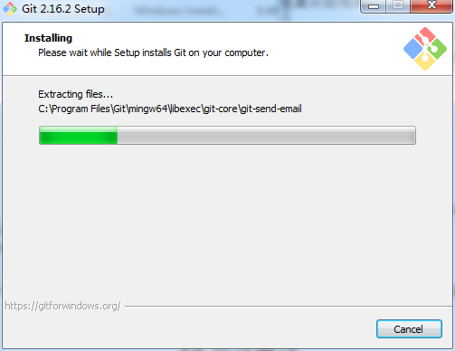

当这个界面安装完成时，显示安装完成界面，可以勾选是否启动启动Git Bash和是否查看发行说明，然后点Finish按钮退出安装界面。

### 13.启动测试

  到此，Git的安装完成，可以在开始菜单中看到Git的三个启动图标（Git Bash、Git CMD(Deprecated)、Git GUI）。

### 14.启动测试

​	可以配置乌龟可视化界面TortoiseGit（默认GUI界面未使用过）

本文摘自：<http://www.cnblogs.com/xueweisuoyong/>