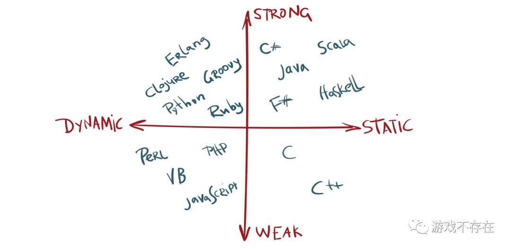

## 语言分类

我们先从最基本的一些语言分类概念聊起，对这部分内容非常了解的朋友可以跳过。

### 静态语言 vs 动态语言

如果在编译时知道变量的类型，则该语言为静态类型。静态类型语言的常见示例包括Java，C，C ++，FORTRAN，Pascal和Scala。在静态类型语言中，一旦使用类型声明了变量，就无法将其分配给其他不同类型的变量，这样做会在编译时引发类型错误。

```java
# java

int data;
data = 50;
data = “Hello Game_404!”; // causes an compilation error
```

如果在运行时检查变量的类型，则语言是动态类型的。动态类型语言的常见示例包括JavaScript，Objective-C，PHP，Python，Ruby，Lisp和Tcl。在动态类型语言中，变量在运行时通过赋值语句绑定到对象，并且可以在程序执行期间将相同的变量绑定到不同类型的对象。

```python
# python

data = 10;
data = "Hello Game_404!"; // no error caused
data = data + str(10)
```

一般来说静态语言编译成字节码执行，动态语言使用解释器执行。编译型语言性能更高，但是较难移植到不同的CPU架构体系和操作系统。解释型语言易于移植，性能会比编译语言要差得多。这是频谱的两个极端。

### 强类型语言 vs 弱类型语言

强类型语言是一种变量被绑定到特定数据类型的语言，如果类型与表达式中的预期不一致，将导致类型错误，比如下面这个:

```python
# python

temp = “Hello Game_404!”
temp = temp + 10; // program terminates with below stated error (TypeError: must be str, not int)
```

python和我们感觉不一致，背叛了弱类型语言，不像世界上最好的语言

```php
# php

$temp = “Hello Game_404!”;
$temp = $temp + 10; // no error caused
echo $temp;
```

常见编程语言的象限分类如下图:



## python的解释器实现

python是一门动态编程语言，由特定的解释器解释执行。下面是一些解释器实现:

- CPython 使用c语言实现的解释器
- PyPy 使用python语言的子集RPython实现的解释器，一般情况下PyPy比CPython快4.2倍
- Stackless Python 带有协程实现的解释器
- Jython Java实现的解释器
- IronPython .net实现的解释器
- Pyston 一个较新的实现，是CPython 3.8.8的一个分支，具有其他针对性能的优化。它针对大型现实应用程序（例如Web服务），无需进行开发工作即可提供高达30％的加速。
- ...

还有几个相关概念:

- IPython && Jupyter ipython是使用python构建的交互式shell, Jupyter是其web化的包装。
- Anaconda 是一个python虚拟环境，Python数据科学常用。
- mypyc 一个新的项目，将python编译成c代码库，以期提高python的运行效率。
- py文件和pyc文件 pyc文件是python编译后的字节码，也可以由python解释器执行。
- wheel文件和egg文件 都是项目版本发布的打包文件，wheel是最新标准。
- ...

这里大家会有一个疑问，python不是解释型语言嘛？怎么又有编译后的pyc。是这样的: py文件编译成pyc后，解释器默认 **优先** 执行pyc文件，这样可以加快python程序的 **启动速度** (注意是启动速度)。继背叛弱类型语言后，python这个鬼又在编译语言和解释语言之间横跳。

还有一个事件是Go语言在1.5版本实现自举。Go语言在1.5版本之前使用c实现的编译器，在1.5版本时候使用Go实现了自己的编译器，这里有一个鸡生蛋和蛋生鸡的过程，也挺有意思。


## pypy为什么快

pypy使用python的子集rpython实现了解释器，和前面介绍的Go的自举有点类似。反常识的是rpython的解释器会比c实现的解释器快？主要是因为pypy使用了JIT技术。

Just-In-Time (JIT) Compiler 试图通过对机器码进行一些实际的编译和一些解释来获得两全其美的方法。简而言之，以下是JIT编译为提高性能而采取的步骤：

1. 标识代码中最常用的组件，例如循环中的函数。
2. 在运行时将这些零件转换为机器码。
3. 优化生成的机器码。
4. 用优化的机器码版本交换以前的实现。

这也是 “pypy为什么能让python比c还快” 一文中的示例展现出来的能力。pypy除了速度快外，还有下面一些特点:

- 内存使用情况比cpython少
- gc策略更优化
- Stackless 协程模式默认支持，支持高并发
- 兼容性好，高度兼容cpython实现，基本可以无缝切换

> 以上都是宣称

pypy这么强，快和省都占了，为什么没有大规模流行起来呢? 我个人认为，主要还是python的原因。

1. python生态中大量库采用c实现，特别是科学计算/AI相关的库，pypy在这块并没有优势。pypy快的主要在pure-python，也就是纯粹的python实现部分。
2. pypy适合长驻内存的高并发应用（web服务类）
3. python是一门胶水语言，并不追求性能极致，即使快4倍也不够快:( 🐶。肯定比不上c，原文中的c应该是 **偷换了概念** ，指c实现的cpython解释器。

需要注意的是，pypy一样也有GIL的存在, 所以高并发主要在stackless。

> 

## 性能比较

我们可以编写性能测试用例，用代码说话，对各个实现进行对比。本文的测试用例并不严谨，不过也足够说明一些问题了。


摘自：[Python猫](https://mp.weixin.qq.com/s/z7q9SJSq3cutS10TQqlo2Q)


